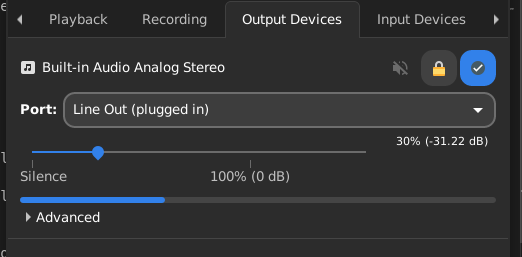

## dotfiles
This is my dotfiles for the XFCE desktop environment and Void Linux

## Installation
#### Distro
Make sure you're running Void Linux's latest version. Grab the iso of Void Linux from [here](https://voidlinux.org/).\
After installation invokes these commands mentioned below.
```sh
xbps-install -Su xbps
xbps-install -Su
```

#### Essential packages
Void Linux doesn't come with a bunch of packages, all extensions related to XFCE DE aren't preinstalled. We need to install them manually.
```sh
xbps-install -S xfce4-pulseaudio-plugin xfce4-screenshooter xfce4-whiskermenu-plugin
```
There's also one issue you'll see when you install or boot into live iso that sound isn't playing through output device. To fix that we need to install alsa (backend) for audio.
```sh
xbps-install -S alsa-utils
```
Now add xfce4-pulseaudio-plugin and xfce4-whiskermenu-plugin and open pulseaudio settings (Audio Mixer) and goto "Output devices" and select port Line Out (or whatever in your case)
<details>
    <summary>Image
    </summary>
    
</details>

Install other core packages
```sh
xbps-install -S wget curl nano vim unzip xz
```

#### Setup lightdm
By default Void Linux uses lxdm login manager, however, it's not pretty obvious, so here we'll use lightdm.
```sh
xbps-install -S lightdm lightdm-gtk3-greeter lightdm-gtk-greeter-settings
```
Remove lxdm as it's no longer needed and will conflict
```sh
xbps-remove -R lxdm
```
Remove lxdm service and link new lightdm service
```sh
rm -rf /var/service/lxdm
yes | cp lightdm/*.conf /etc/lightdm/
ln -s /etc/lightdm/ /var/lib/lightdm
```
Note: If the screen goes black reboot and try to remove lxdm, and never create lightdm-gtk-greeter service without purging lxdm first.


#### Install themes, icons, and fonts
Instead moving themes, icons and fonts files globally we'll create `.themes`, `.icons` and `.fonts` directory in the user directory. It's also convenient for each user accounts.
```sh
mkdir ~/.themes
mkdir ~/.icons
mkdir ~/.fonts
```
###### Themes
Download Orchis gtk theme from [here](https://www.xfce-look.org/p/1357889) and extract the archive to the `~/.themes` directory. Goto appearance and now change the theme to Orchis-Dark and as well change the window manager to the theme Orchis-Dark.

###### Icons
Download the Papirus icon theme from [here](https://www.xfce-look.org/p/1166289/) and extract the archive to the `~/.icons` directory. Goto appearance and now select Papirus-Dark. 
Note: If icon theme changes are failed to load or you're unable to change at that moment update the icon cache with `gtk-update-icon-cache` tool or log out and log in again.

###### Fonts
In Void, there won't be also extra fonts preinstalled (only necessary ones). We need to install a bunch of fonts for a better experience. 
```sh
xbps-install -S noto-fonts-emoji noto-fonts-ttf noto-fonts-ttf-extra noto-fonts-cjk ttf-ubuntu-font-family

# Download a nerd font (for terminal)
curl https://github.com/ryanoasis/nerd-fonts/releases/latest/download/SourceCodePro.zip --output SourceCodePro.zip

# Extra, download Fira Sans for Firefox
curl https://fonts.google.com/download?family=Fira%20Sans --output FiraSans.zip
```
After completing these steps, let's install all these fonts
```sh
mv SourceCodePro.zip ~/.fonts
mv FiraSans.zip ~/.fonts
unzip ~/.fonts/SourceCodePro.zip
unzip ~/.fonts/FiraSans.zip
unzip extra/Fura_Mono.tar.gz && mv Fura_Mono/* ~/.fonts
rmdir extra/Fura_Mono

# Remove all .txt and .md files which was also moved with fonts
rm ~/.fonts/*.txt && rm ~/.fonts/*.md 
```
For bitmap fonts (especially required by browsers)
```sh
ln -s /usr/share/fontconfig/conf.avail/70-no-bitmaps.conf /etc/fonts/conf.d/
```
Now refresh fontconfig and fonts cache
```sh
xbps-reconfigure -f fontconfig
fc-cache -f
```

#### Install neofetch
Neofetch is available in the Void package repo but we'll only use the latest version pulled from GitHub
```sh
mkdir /opt/neofetch
curl https://raw.githubusercontent.com/dylanaraps/neofetch/master/neofetch --output neofetch
mv neofetch /opt/neofetch
chmod +x /opt/neofetch/neofetch
ln -s /opt/neofetch /usr/sbin/neofetch
```

#### Setup oh-my-zsh
ZSH is an amazing shell, but we need to configure it according to our purpose.
Install ZSH by invoking the below command
```sh
xbps-install -S zsh
```
Install oh-my-zsh
```sh
bash -c "$(curl -fsSL https://raw.githubusercontent.com/ohmyzsh/ohmyzsh/master/tools/install.sh)"

# Now I'm also going to copy my .zshrc file to your home directory, however, if you want to configure it by yourself, you may skip this step
yes | cp zshconf/.zshrc ~/.zshrc
source ~/.zshrc
```

#### Install Node.js
Node.js is a JavaScript interpreter and an optional step. We'll use nvm to install nodejs
```sh
curl -o- https://raw.githubusercontent.com/nvm-sh/nvm/v0.39.1/install.sh | bash
```
Export the path of the nvm directory
```sh
export NVM_DIR="$([ -z "${XDG_CONFIG_HOME-}" ] && printf %s "${HOME}/.nvm" || printf %s "${XDG_CONFIG_HOME}/nvm")"
[ -s "$NVM_DIR/nvm.sh" ] && \. "$NVM_DIR/nvm.sh"

source ~/.zshrc
source ~/.bashrc
```
Now, to select what nodejs version you want, run the following command
```sh
# Change node to --lts (for lts release) or 16.0.0 (for a specific version)
nvm install node
```
You may also want these node packages to install, remember whole Node.js topic is optional, and this section too
```sh
npm i --location=global yarn pnpm typescript eslint
```

#### Install VSCode
Download VSCode's latest version and install
```sh
curl https://code.visualstudio.com/sha/download?build=stable&os=linux-x64 --output code.tar.gz
tar xf code.tar.gz
mv VSCode-linux-x64 /opt
export PATH=/opt/VSCode-linux-x64/bin:$PATH
source ~/.zshrc
source ~/.bashrc
```

#### Install Tor Browser
Download the Tor browser from the official Tor browser website. (Version depends on the download URL, so you may need to change it for each release)

```sh
curl https://www.torproject.org/dist/torbrowser/11.5.2/tor-browser-linux64-11.5.2_en-US.tar.xz --output tor_browser.tar.xz
tar xf tor_browser.tar.xz
mv tor-browser_en-US /opt

# Now create a shortcut (Tor application shortcut)
cat <<EOF >/usr/share/applications/tor-browser.desktop
[Desktop Entry]
Version=1.0
Name=Tor Browser
Comment=Browse the web anonymously
GenericName=Web Browser
Keywords=Browser;Web Browser;Internet
Exec=/opt/tor-browser_en-US/Browser/firefox
Terminal=false
X-MultipleArgs=false
Type=Application
Icon=/opt/tor-browser_en-US/Browser/browser/chrome/icons/default/default64.png
Categories=Network;WebBrowser;
MimeType=""
StartupNotify=true
EOF
```

#### Settings
Now to apply change your applications and default fonts
- For the window manager "titlebar" select DejaVu Sans Mono Book
- Goto appearance and uncheck "Show images on buttons"
- Open Firefox, go to the general tab and see fonts in there, select advanced, and now set Proportional font "Sans Serif", Serif "Fira Sans", Sans-Serif "Fira Sans", Monospace "DejaVu Sans Mono". Set the proportional font size 14 and monospace 12.


#### Other dev tools
These tools are also options
```sh
xbps-install -S git gcc ruby base-devel ruby-build ruby-devel
```

Now you need to configure it properly and done!
